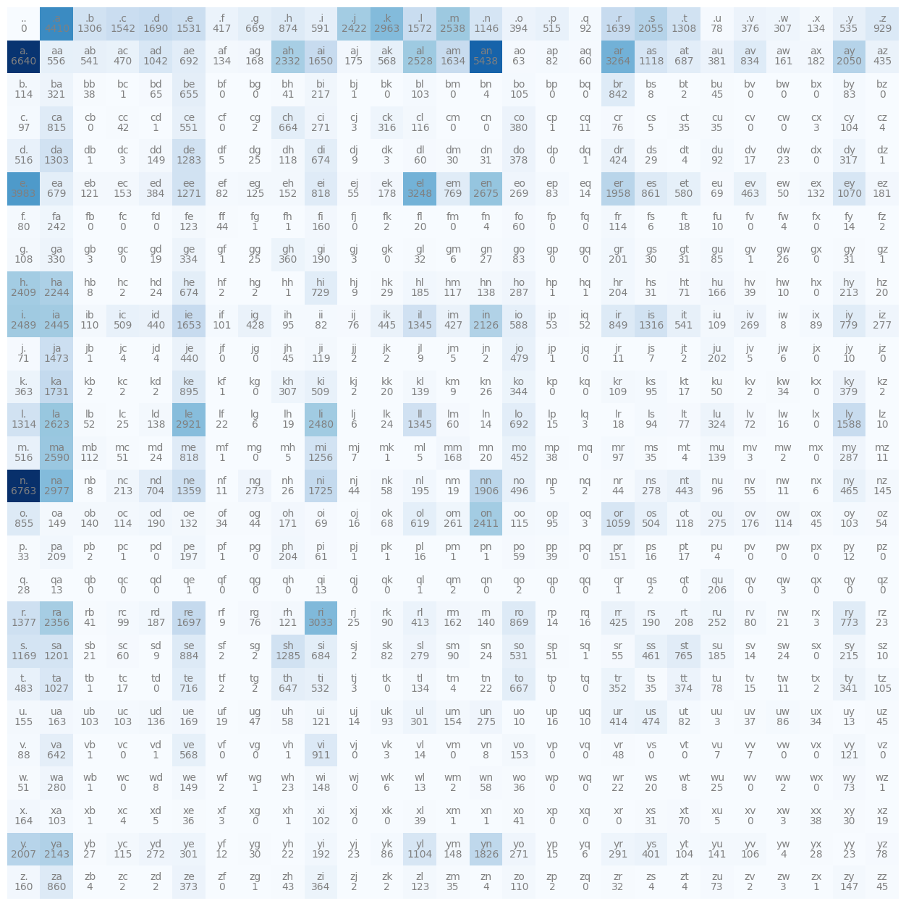

# Make More

## Description

Makemore is a simple character level language model, which means it predicts the next character in a sequence of characters. The goal of Makemore is to learn the statistical relationship between characters in a language.

Makemore used bigram model to predict the next character. The bigram model is a simple statistical model that makes a prediction based on the previous character. For example, if the previous character is "a", then the next character is likely to be "n". The bigram model is a simple statistical model that makes a prediction based on the previous character. For example, if the previous character is "a", then the next character is likely to be "n".

A Bigram Distribution is where the x-axis is the previous character and the y-axis is the next character. The color of each cell represents the probability of the next character given the previous character. The darker the cell, the higher the probability.

